# 🛡️ AWS Secure Network Builder

> A Python-based automation tool utilizing Boto3 to programmatically deploy secure, compliant AWS network infrastructures with enterprise-grade security controls.

[](https://www.python.org/downloads/)
[](https://aws.amazon.com/sdk-for-python/)
[](LICENSE)

---

## 📋 Overview

AWS Secure Network Builder automates the creation of production-ready VPCs, tiered subnets, and hardened Security Groups based on YAML configuration files. Built with infrastructure-as-code principles, this tool eliminates manual AWS console clicks and enforces consistent security standards across deployments.

### Key Capabilities

**🏗️ VPC Automation**  
One-click deployment of VPCs with custom CIDR blocks and comprehensive tagging strategies.

**🏛️ Tiered Architecture**  
Automatically creates Public (DMZ) and Private (App/Data) subnets across multiple Availability Zones for high availability.

**🔒 Security First**  
Deploys "Zero Trust" Security Groups and strict Network ACLs by default, following AWS Well-Architected Framework principles.

**🌐 Gateway Management**  
Intelligently provisions and configures Internet Gateways (IGW) and NAT Gateways with proper routing.

**📊 State Tracking**  
Exports deployment state to JSON for comprehensive auditing, compliance reporting, or infrastructure teardown.

---

## 🚀 Quick Start

### Prerequisites

Ensure you have the following installed and configured:

- **Python 3.9 or higher**
- **AWS CLI** configured with appropriate credentials
- **Boto3 library** for AWS API interactions
- **Active AWS account** with VPC creation permissions

### Installation

Clone the repository and install dependencies:

```bash
git clone https://github.com/yourusername/aws-secure-net.git
cd aws-secure-net
pip install -r requirements.txt
```

Or install dependencies manually:

```bash
pip install boto3 pyyaml
```

### Configure AWS Credentials

```bash
aws configure
```

Provide your AWS Access Key ID, Secret Access Key, default region, and output format when prompted.

---

## 📂 Project Structure

```
aws-secure-net/
├── configs/                 # YAML configuration files
│   ├── prod-vpc.yaml       # Production environment config
│   ├── dev-vpc.yaml        # Development environment config
│   └── staging-vpc.yaml    # Staging environment config
├── logs/                   # Deployment and error logs
│   └── builder.log         # Main application log
├── modules/                # Modular Python components
│   ├── __init__.py
│   ├── vpc.py             # VPC creation and management
│   ├── security.py        # Security Groups and NACLs
│   ├── gateways.py        # IGW and NAT Gateway logic
│   └── utils.py           # Helper functions
├── output/                 # State files and deployment artifacts
│   └── vpc-state.json     # Resource ID mappings
├── tests/                  # Unit and integration tests
├── builder.py             # Main execution script
├── requirements.txt       # Python dependencies
├── .gitignore
├── LICENSE
└── README.md
```

---

## 📊 Deployment Workflow

The following diagram illustrates the complete automation flow from configuration loading to AWS resource provisioning:

```mermaid
%%{init: {'theme':'base', 'themeVariables': { 'primaryColor':'#FF9900','primaryTextColor':'#232F3E','primaryBorderColor':'#232F3E','lineColor':'#545B64','secondaryColor':'#146EB4','tertiaryColor':'#fff','fontSize':'16px'}}}%%
graph TD
    Start([🚀 Start Builder]) --> LoadConfig[/📄 Load config.yaml/]
    LoadConfig --> ValidateCreds{🔐 Validate AWS<br/>Credentials}
    
    ValidateCreds -->|❌ Failed| LogError[⚠️ Log Error & Exit]
    ValidateCreds -->|✅ Success| InitSession[Initialize Boto3 Session]
    
    InitSession --> CreateVPC[Create VPC & Apply Tags]
    CreateVPC --> CreateIGW[Create Internet Gateway]
    CreateIGW --> CreateRT[Create Route Tables<br/>Public & Private]
    
    CreateRT --> LoopSubnets[🔄 Loop Through Subnets]
    LoopSubnets --> CheckType{Subnet Type?}
    
    CheckType -->|🌐 Public| AssocIGW[Associate with IGW<br/>Route Table]
    CheckType -->|🔒 Private| AssocNAT[Associate with NAT<br/>Route Table]
    
    AssocIGW --> ApplySecurity[Apply NACLs &<br/>Security Groups]
    AssocNAT --> ApplySecurity
    
    ApplySecurity --> LogResources[📝 Log Resource IDs]
    LogResources --> MoreResources{More Subnets<br/>to Create?}
    
    MoreResources -->|Yes| LoopSubnets
    MoreResources -->|No| ExportState[💾 Export State to JSON<br/>output/ directory]
    ExportState --> End([✅ Deployment Complete])
    
    LogError --> End

    classDef startEnd fill:#FF9900,stroke:#232F3E,stroke-width:3px,color:#fff
    classDef process fill:#146EB4,stroke:#232F3E,stroke-width:2px,color:#fff
    classDef decision fill:#EC7211,stroke:#232F3E,stroke-width:2px,color:#fff
    classDef input fill:#527FFF,stroke:#232F3E,stroke-width:2px,color:#fff
    classDef critical fill:#D13212,stroke:#232F3E,stroke-width:2px,color:#fff
    classDef success fill:#1D8102,stroke:#232F3E,stroke-width:2px,color:#fff
    
    class Start,End startEnd
    class InitSession,CreateVPC,CreateIGW,CreateRT,AssocIGW,AssocNAT,ApplySecurity,LogResources,ExportState process
    class ValidateCreds,CheckType,MoreResources decision
    class LoadConfig input
    class LogError critical
    class LoopSubnets success
```



---

## 🎯 Usage Guide

### Step 1: Define Your Network Architecture

Create a YAML configuration file in the `configs/` directory. Here's a comprehensive example:

```yaml
# configs/prod-secure-vpc.yaml
vpc_name: "prod-secure-network"
cidr: "10.0.0.0/16"
region: "us-east-1"
enable_dns_hostnames: true
enable_dns_support: true

tags:
  Environment: "Production"
  ManagedBy: "AWS-Secure-Builder"
  CostCenter: "Engineering"

subnets:
  # Public Subnets (DMZ Layer)
  - name: "public-web-1a"
    cidr: "10.0.1.0/24"
    type: "public"
    az: "us-east-1a"
    
  - name: "public-web-1b"
    cidr: "10.0.2.0/24"
    type: "public"
    az: "us-east-1b"
  
  # Private Subnets (Application Layer)
  - name: "private-app-1a"
    cidr: "10.0.10.0/24"
    type: "private"
    az: "us-east-1a"
    
  - name: "private-app-1b"
    cidr: "10.0.11.0/24"
    type: "private"
    az: "us-east-1b"
  
  # Private Subnets (Database Layer)
  - name: "private-db-1a"
    cidr: "10.0.20.0/24"
    type: "private"
    az: "us-east-1a"
    
  - name: "private-db-1b"
    cidr: "10.0.21.0/24"
    type: "private"
    az: "us-east-1b"

nat_gateway:
  enabled: true
  availability_zone: "us-east-1a"

security_groups:
  web_tier:
    - protocol: "tcp"
      from_port: 443
      to_port: 443
      cidr: "0.0.0.0/0"
    - protocol: "tcp"
      from_port: 80
      to_port: 80
      cidr: "0.0.0.0/0"
```

### Step 2: Execute the Builder

Run the deployment script with your configuration file:

```bash
python3 builder.py --config configs/prod-secure-vpc.yaml
```

**Advanced Options:**

```bash
# Dry-run mode (validate without deploying)
python3 builder.py --config configs/prod-secure-vpc.yaml --dry-run

# Verbose logging
python3 builder.py --config configs/prod-secure-vpc.yaml --verbose

# Specify custom output directory
python3 builder.py --config configs/prod-secure-vpc.yaml --output-dir ./custom-output
```

### Step 3: Verify Deployment

**Check the output state file:**

```bash
cat output/prod-secure-network-state.json
```

**Verify in AWS Console:**

Navigate to **AWS Console → VPC Dashboard** to inspect your newly created infrastructure components.

**Using AWS CLI:**

```bash
aws ec2 describe-vpcs --filters "Name=tag:Name,Values=prod-secure-network"
```

---

## 🔧 Configuration Reference

### VPC Settings

| Parameter | Type | Required | Description |
|-----------|------|----------|-------------|
| `vpc_name` | string | ✅ | Unique identifier for the VPC |
| `cidr` | string | ✅ | IPv4 CIDR block (e.g., 10.0.0.0/16) |
| `region` | string | ✅ | AWS region for deployment |
| `enable_dns_hostnames` | boolean | ❌ | Enable DNS hostname resolution (default: true) |
| `enable_dns_support` | boolean | ❌ | Enable DNS support (default: true) |

### Subnet Configuration

| Parameter | Type | Required | Description |
|-----------|------|----------|-------------|
| `name` | string | ✅ | Subnet identifier |
| `cidr` | string | ✅ | Subnet CIDR block (must be within VPC CIDR) |
| `type` | string | ✅ | `public` or `private` |
| `az` | string | ✅ | Availability Zone (e.g., us-east-1a) |

---

## 🛠️ Advanced Features

### Teardown Infrastructure

Remove all created resources using the state file:

```bash
python3 builder.py --teardown --state-file output/prod-secure-network-state.json
```

### Multi-Region Deployment

Deploy the same architecture across multiple regions:

```bash
python3 builder.py --config configs/prod-secure-vpc.yaml --regions us-east-1,us-west-2,eu-west-1
```

### Integration with CI/CD

Example GitHub Actions workflow:

```yaml
name: Deploy AWS Network

on:
  push:
    branches: [main]

jobs:
  deploy:
    runs-on: ubuntu-latest
    steps:
      - uses: actions/checkout@v3
      - name: Set up Python
        uses: actions/setup-python@v4
        with:
          python-version: '3.9'
      - name: Install dependencies
        run: pip install -r requirements.txt
      - name: Deploy VPC
        env:
          AWS_ACCESS_KEY_ID: ${{ secrets.AWS_ACCESS_KEY_ID }}
          AWS_SECRET_ACCESS_KEY: ${{ secrets.AWS_SECRET_ACCESS_KEY }}
        run: python3 builder.py --config configs/prod-secure-vpc.yaml
```

---

## 🔐 Security Best Practices

This tool implements several security-hardening measures:

- **Principle of Least Privilege**: Security Groups deny all traffic by default
- **Network Segmentation**: Clear separation between public, application, and data tiers
- **Encrypted Communications**: VPC Flow Logs enabled by default
- **Audit Trail**: All resource creation logged with timestamps and user context
- **Immutable Infrastructure**: State files enable consistent, repeatable deployments

### IAM Permissions Required

Your AWS user/role needs the following permissions:

```json
{
  "Version": "2012-10-17",
  "Statement": [
    {
      "Effect": "Allow",
      "Action": [
        "ec2:CreateVpc",
        "ec2:CreateSubnet",
        "ec2:CreateInternetGateway",
        "ec2:CreateNatGateway",
        "ec2:CreateRouteTable",
        "ec2:CreateSecurityGroup",
        "ec2:CreateNetworkAcl",
        "ec2:CreateTags",
        "ec2:DescribeVpcs",
        "ec2:DescribeSubnets",
        "ec2:AllocateAddress"
      ],
      "Resource": "*"
    }
  ]
}
```

---

## 🤝 Contributing

We welcome contributions from the community! Whether it's bug fixes, feature enhancements, or documentation improvements, your help makes this tool better for everyone.

### How to Contribute

1. **Fork the repository** on GitHub
2. **Create a feature branch** from `main`:
   ```bash
   git checkout -b feature/add-vpn-support
   ```
3. **Make your changes** with clear, descriptive commits
4. **Add tests** for new functionality
5. **Update documentation** as needed
6. **Push your branch** and open a Pull Request

### Development Setup

```bash
# Clone your fork
git clone https://github.com/yourusername/aws-secure-net.git
cd aws-secure-net

# Create virtual environment
python3 -m venv venv
source venv/bin/activate

# Install development dependencies
pip install -r requirements-dev.txt

# Run tests
pytest tests/
```

### Code Style

We follow PEP 8 guidelines. Please run linting before submitting:

```bash
flake8 modules/ builder.py
black modules/ builder.py
```


---

## 🙋 Support

**Found a bug?** Open an issue on [GitHub Issues](https://github.com/careed23/aws-secure-net/issues)

**Have questions?** Start a discussion in [GitHub Discussions](https://github.com/careed23/aws-secure-net/discussions)

**Need enterprise support?** Contact us at support@example.com

---

## 🎯 Roadmap

Planned features for future releases:

- ⬜ VPN Gateway support
- ⬜ Transit Gateway integration
- ⬜ VPC Peering automation
- ⬜ AWS Organizations support
- ⬜ Terraform state file export
- ⬜ CloudFormation template generation
- ⬜ Cost estimation before deployment
- ⬜ Compliance scanning (CIS, PCI-DSS)

---

## 🌟 Acknowledgments

Built with ❤️ using:
- [Boto3](https://boto3.amazonaws.com/v1/documentation/api/latest/index.html) - AWS SDK for Python
- [PyYAML](https://pyyaml.org/) - YAML parser and emitter
- [Click](https://click.palletsprojects.com/) - Command-line interface creation kit

Special thanks to all contributors who have helped shape this project!

---

<div align="center">

**Made with ☁️ for the AWS community**

[⭐ Star this repo](https://github.com/careed23/aws-secure-net) | [🐛 Report Bug](https://github.com/careed23/aws-secure-net/issues) | [💡 Request Feature](https://github.com/careed23/aws-secure-net/issues)

</div>

